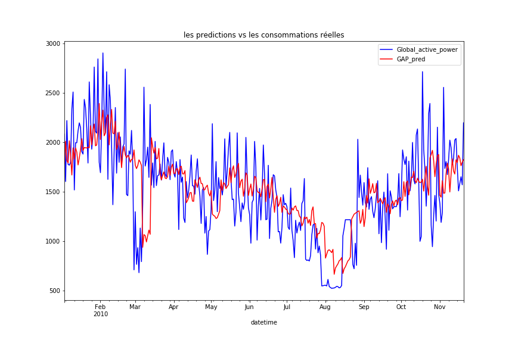

# Consommation électrique individuelle des ménages

[La Consommation électrique des ménages](https://archive.ics.uci.edu/ml/datasets/Individual+household+electric+power+consumption) est un jeu de données temporelles multivariées décrivant la consommation d'électricité d'un seul ménage sur quatre ans.

Les données ont été collectées entre décembre 2006 et novembre 2010 et des observations de la consommation d'énergie au sein du ménage ont été collectées chaque minute.

C'est une série multivariée composée de sept variables (en plus de la date et de l'heure).

1. date: Date in format dd/mm/yyyy 
2. time: time in format hh:mm:ss 
3. global_active_power: household global minute-averaged active power (in kilowatt) 
4. global_reactive_power: household global minute-averaged reactive power (in kilowatt) 
5. voltage: minute-averaged voltage (in volt) 
6. global_intensity: household global minute-averaged current intensity (in ampere) 
7. sub_metering_1: energy sub-metering No. 1 (in watt-hour of active energy). It corresponds to the kitchen, containing mainly a dishwasher, an oven and a microwave (hot plates are not electric but gas powered). 
8. sub_metering_2: energy sub-metering No. 2 (in watt-hour of active energy). It corresponds to the laundry room, containing a washing-machine, a tumble-drier, a refrigerator and a light. 
9. sub_metering_3: energy sub-metering No. 3 (in watt-hour of active energy). It corresponds to an electric water-heater and an air-conditioner.

## Objectif

Je veux créer un modèle de Machine Learning à résoudre un problème.

**Quelle est la consommation électrique prévue pour la semaine à venir?** 

## Nettoyage les données
Avant de créer le modèle, il faut assurer que les données sont propre. Donc, je commence par nettoyer les données.

D'abord, je **fusionne les prémière et deuxième colonnes dans une colonne**. La nouvelle colonne doit être dans le format `datetime`. Elle est aussi l'indice de données. C'est pour facilité de traitement.

Ensuite, je **remplis les valeurs manquantes** qui sont indiqué par le fournisseur.

Donc, je remplis ces valeurs manquantes par les mêmes données de la même heure la veille.

A la fin, je **créer la colonne `Sub_metering_4`**. Le fournisseur a aussi indiqué que l'énergie active consommée chaque minute (en wattheures) dans le ménage par du matériel électrique non mesuré dans les `Sub_metering_1, 2 et 3` est calculé par `(global_active_power*1000/60 - sub_metering_1 - sub_metering_2 - sub_metering_3)`. Donc, je le mets dans la colonne `Sub_metering_4`.

Les données nettoyées sont présenté ici.

## Visualisation des données

La somme de consommation de chaque jour est intéressant car je veux prevoir celle pour la semaine à venir. Donc, je la calcule pour chaque inducteur (C'est-à-dire chaque colonne dans le tableau), et sauvegarde le résultat. L'étude suivante est basée sur ce résultat.

Ensuite, j'analyse le pattern de consommation dans une semaine de `Global_active_power` et `Sub_metering`. On voit que les clients consomme plus dans le week-end, et la consommation détecté par `Sub_metering 3 et 4` est beaucoup plus haut que celle détecté par les autres. 

*C'est intéressant de faire la même chose pour `Global_reactive_power`,`Voltage` et `Global_intensity` si on a le temps.*

   

D'ailleurs, je aussi analyse la saisonnalité. Je trouve que `Global_active_power` et `Sub_metering 3 et 4` ont la saisonnalité.

## Création du modèle de Machine Learning

Je veux créer un modèle de Machine Learning à predire la consommation électrique prévue pour la semaine à venir. Je sépare cette tâche dans 3 partie.

### transformer les données

Je utilise les données des **trois premières années** pour l'entrainement du modèle et **la dernière année** pour l'évaluation du modèle.

Les données d'un ensemble de données seront divisées en semaines. Ce sont des semaines qui commencent un dimanche et se terminent un samedi. Donc, pour l'ensemble de train, il y a 159 semaines, et l'ensemble de test a 46 semaines.

### créer l'algo `Recursive Multi-Step Forecasting`

En gros, cette algo utilise le modèle fait une prédiction pour un pas de temps, et elle prend cette prédiction comme les donées d'entrée pour faire la prochaine prédiction dans un pas de temps suivant. Ce processus est répété jusqu'à ce que le nombre d'étapes souhaité ait été prévu.

Dans ce projet, un pas de temps est une semaine. Par example, j'utilise les données d'une semaine pour faire une prédiction sur le prochain Dimanche. 

Le modèle est un modèle supervisé. Je choisis `Regression Linéaire` qui est simple et interprétable. D'ailleurs, j'ajoute 2 couches avant le modèle pour standaliser et normaliser les données d'entrée.

### entraîner le modèle et faire la prédiction

Le modèle utilisé dans l'algo est entraîné par l'ensemble de train (les données de première trois années). Ensuite, je applique l'algo pour faire la prédiction sur l'années suivante.

## Résultats

J'affiche la prédiction et la consommation réelle dans la dernier année. On voit que elles sont proche. 

Mais, la prédiction sont retardée par rapport à la consommation. Par example, la consommation descend plus tôt que la prédiction entre Juin et Août. Je crois le fait que la prédiction est basé sur les données une semaine pose ce problème. Si on choisit un mois de données, les deux courbes vont être plus proche. 

J'affiche la même chose dans la dernière semaine. On voit que le modèle est mal à predire la consommation de Samedi et Dimanche.

## Prochaines Etapes

Il reste plusieurs choses à améliorer.

1. choisir les méthodes différentes pour standaliser et normaliser les données

2. choisir une période différente, un mois par example, pour faire la prédiction

3. choisir les modèles différents et trouver les paramètres optimals dans les modèles.

4. Appliquer un l'algo différent pour résoudre ce problème. Par example, CNN-LSTM est un modèle très intéressant.